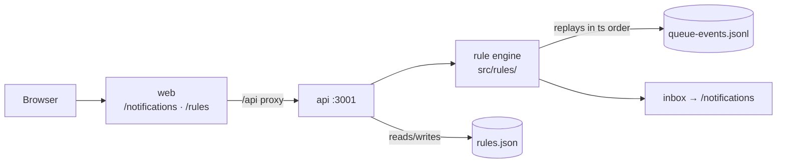

# Intraday Notification System

Users configure their own notification rules. The system evaluates them against a stream of queue events and delivers the results to whoever can act on them.

```bash
pnpm install && pnpm dev
```

Switch users in the header to see one feed produce different notifications per audience.

---

## Who this is for

Three audiences appear in the prompt. I built for two directly and served the third through the same engine.

- **Team leads — primary.** The only audience with both the breadth to care about every event type and the authority to act within the day. The rule model is designed around them.
- **Agents — self-scoped only.** An agent can act on exactly one thing: their own adherence. The engine refuses to deliver anything whose subject isn't that agent (`deliverableTo`), enforced in code so a mis-scoped rule can't leak. A relevance decision, not a security one — auth is out of scope.
- **Heads of support — same rules, higher floor.** "Only when it's genuinely on fire" is a threshold, not a feature. They receive `critical` only, which keeps one evaluation path instead of two.

## System Design



- **`@assembled/types`** — the shared contract: event and rule types, plus Zod schemas bound to them with `satisfies z.ZodType<T>`.
- **`apps/api`** — Express. Rule CRUD and `POST /api/notifications`. The rule engine lives here rather than in a shared package: evaluation needs the feed, and the feed is server-side.
- **`apps/web`** — React + Tailwind. `/notifications` (the inbox) and `/rules` (the builder).

## Rules are configuration, not code *Declarative not Imparative*

```json
{
  "event_type": "adherence_check",
  "conditions": [{ "field": "in_violation", "op": "eq", "value": true }],
  "sustained_for_sec": 600,
  "scope": { "queue_ids": null, "agent_ids": ["a_19"] },
  "severity": "warning",
  "cooldown_sec": 900
}
```

Conditions are AND-only. A rule needing OR is two rules — no nested boolean editor to build, no precedence for a user to get wrong.

`sustained_for_sec` is what makes this a notification system rather than a threshold alarm, and it forces two things:

- **Duration is tracked, not read off an event.** An agent stuck on one call emits no further events, so "45 minutes" can only be noticed on *someone else's* event. The engine advances a clock on every event and sweeps open episodes.
- **A real start time wins where one exists.** `adherence_check` carries `violation_started_at`, which beats "when we first saw it" if you joined mid-breach — with a fallback, since the feed contains `in_violation: true` alongside a null start.

## Persistence

**No database, deliberately.** State is split by whether it can be recomputed:

- **Rules are authored** — a user typed them, nothing can reproduce them — so they persist to JSON behind `RulesRepository`. `rules.seed.json` is committed so a fresh clone is demonstrable; `rules.json` is gitignored and written on first mutation. A missing file is the normal first-run state. No setup, no permissions step.
- **Notifications are derived** — replaying a fixed feed is deterministic — so `DeliveryStore` keeps them in memory and recomputes. Nothing is lost on restart.

## Running it

Requires Node 20+ and pnpm (workspaces are declared in `pnpm-workspace.yaml`).

```bash
pnpm install
pnpm dev          # web :5173, api :3001
pnpm test         # all suites
pnpm build        # via the Turborepo pipeline
```
